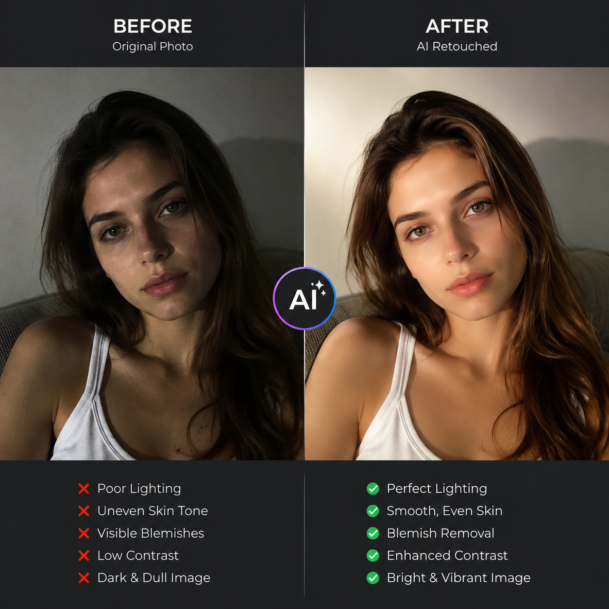

# 可以修图的AI有哪些？2026年AI修图工具推荐

修图一定要学PS吗？不一定。现在可以修图的AI工具很多，上传图片就能自动处理，抠图、调色、修复、美化全搞定。

## 哪些AI可以修图？

市面上的AI修图工具主要分三类：

### 1. 电商商品修图工具

专门为电商卖家设计，功能集中在商品图处理上：
- 一键白底图生成
- 商品背景替换
- 产品图清晰化
- 批量处理

电商商品修图最重要的是**保持产品不变形**，AI工具在这一点上比传统PS更稳定。

### 2. 人像修图工具

主打人像美化功能：
- 自动美颜美肤
- 人像背景替换
- 老照片修复
- 黑白照片上色

### 3. 通用修图工具

功能最全面，但针对性不如垂直工具。

📌 做电商商品图推荐 [aishop.anyachina.cn](https://aishop.anyachina.cn)，智能抠图换背景效果很好。需要做促销海报可以用 [poster.anyachina.cn](https://poster.anyachina.cn)。

## AI修图能做什么？

- **智能抠图**：一键抠出产品主体，边缘精细
- **背景替换**：换成纯白、场景、渐变背景
- **图片修复**：去划痕、去噪点、提升清晰度
- **色彩调整**：自动匹配色调，让图片更高级
- **批量处理**：一次处理几十上百张图

## 怎么选AI修图工具？

看你的需求：
- 电商卖家做商品图 → 选电商专用工具
- 个人修照片 → 选通用修图工具
- 修复老照片 → 选带修复功能的工具

## 总结

可以修图的AI已经很多了，关键是选对工具。电商卖家建议用垂直工具，效果好、效率高。日常修图用通用工具就够了。

---

*在线工具：[未来图AI](https://www.weilaituai.cn/)*
