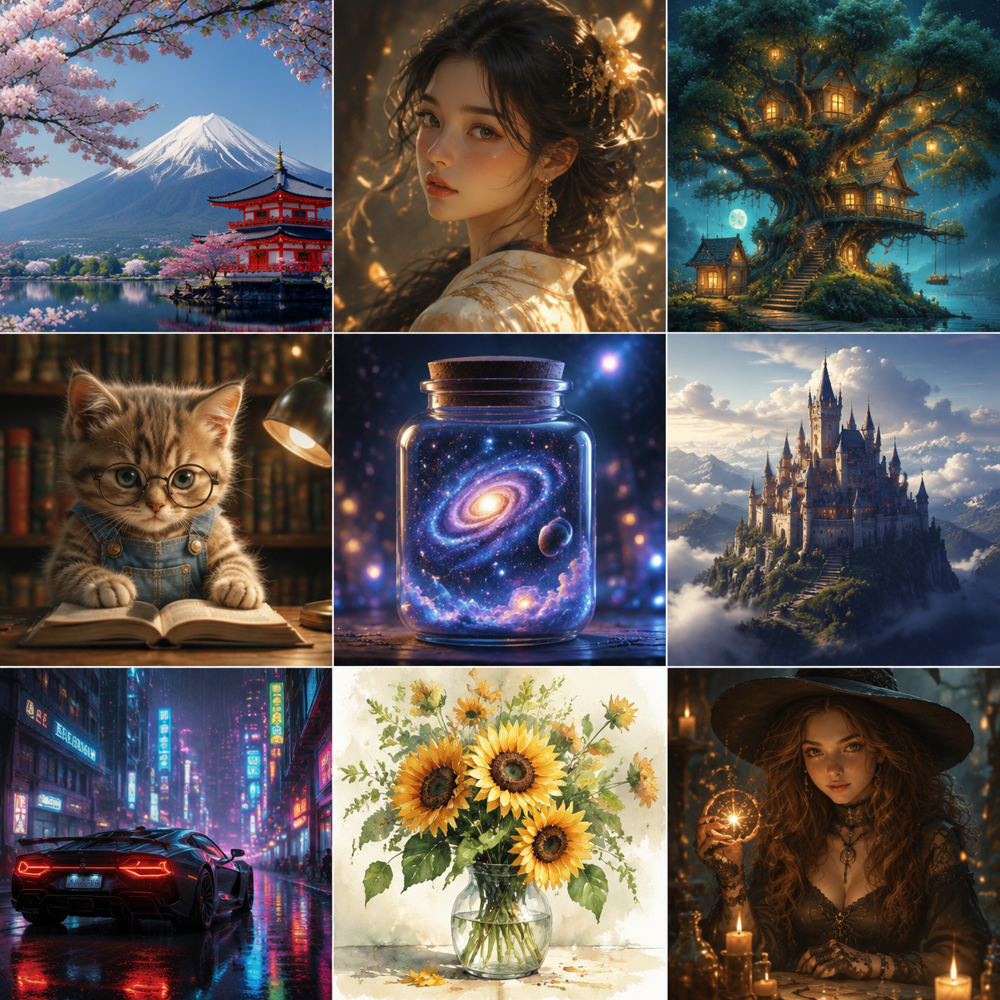

# 可以生成图片的AI有哪些？2026年AI生图工具推荐

可以生成图片的AI工具越来越多，到底哪些好用？本文推荐几款实用的AI生图工具，帮你快速生成高质量图片。

📌 推荐 [aishop.anyachina.cn](https://aishop.anyachina.cn) 做商品图，[poster.anyachina.cn](https://poster.anyachina.cn) 做促销海报，两款AI生图工具都支持中文提示词。

## AI生图工具的核心功能

**文生图**：输入文字描述生成图片
**图生图**：上传参考图生成新图
**风格转换**：图片转不同艺术风格
**图片编辑**：智能修图、抠图、增强

## AI生图工具推荐

### 电商专用型

专为电商场景优化，商品图效果好。支持中文提示词，操作简单。

**适合**：电商卖家

### 通用创意型

风格多样，从写实到插画都能生成。创意空间大。

**适合**：设计师、创意工作者

### 海报设计型

自动排版配色，输入文案出设计稿。

**适合**：运营人员

## AI生图的操作步骤

**第一步**：打开AI生图工具
**第二步**：输入描述文字或上传参考图
**第三步**：选择风格和比例
**第四步**：点击生成
**第五步**：预览下载

## 提示词技巧

好的提示词 = 好图片。记住：主体 + 环境 + 风格 + 细节

---

*在线工具：[未来图AI](https://www.weilaituai.cn/)*
