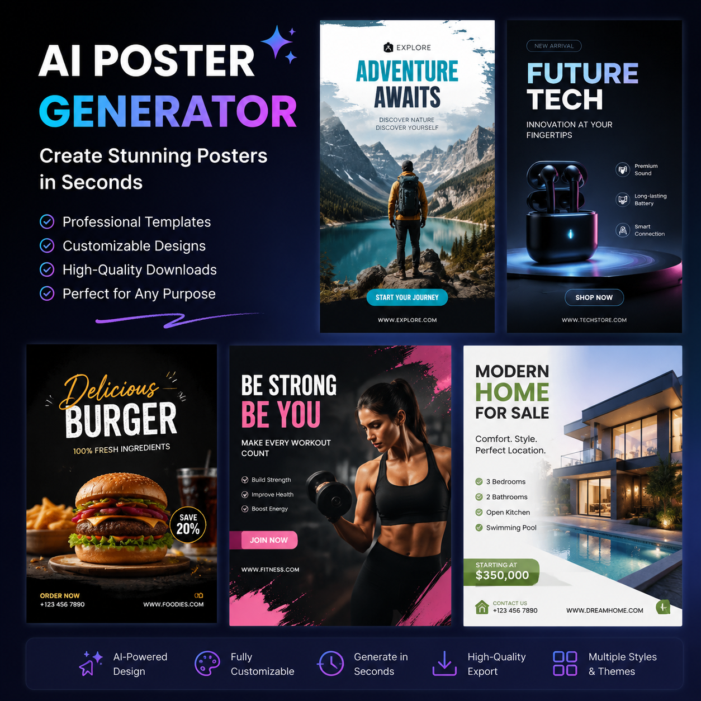

# 可以生成海报的AI工具推荐，2026年AI海报生成器测评

海报制作费时费力？现在可以生成海报的AI工具已经非常成熟。不需要设计基础，上传图片输入文案，AI自动生成专业海报。

📌 推荐 [aishop.anyachina.cn](https://aishop.anyachina.cn) 做商品图和详情页，AI海报生成效果好，电商视觉全搞定。

## 可以生成海报的AI有哪些？

市面上的AI海报生成工具主要分为三类：

**智能生成类**：输入文案和产品图，AI自动完成设计。操作最简单，不需要选模板。

**模板编辑类**：提供大量模板供选择，用户替换内容。模板丰富，选择空间大。

**AI生图类**：输入文字描述，AI直接生成海报。适合没有产品图的场景。

## AI生成海报的常见类型

### 促销海报

突出折扣信息和产品卖点，配色鲜明有冲击力。适合大促、限时折扣等活动。

### 新品海报

展示新品特点，吸引眼球。设计风格更注重视觉效果。

### 品牌海报

品牌形象展示，设计简约大气。突出品牌调性而非产品细节。

### 节日海报

春节、中秋、七夕等节日营销。AI自动匹配节日元素和配色。

## AI生成海报的流程

**第一步**：整理海报需要的素材（产品图、文案、logo等）

**第二步**：打开AI海报生成工具，选择场景

**第三步**：上传素材，输入文案

**第四步**：选择风格，点击生成

**第五步**：预览效果，下载高清图片

## AI海报生成的优势

**节省时间**：从传统设计1-3天缩短到几十秒

**降低成本**：省去设计师费用，几乎零成本

**零门槛**：不需要任何设计经验

**多版本选择**：一键生成多个设计方案

## 选择AI海报工具的要点

1. 模板质量和数量
2. 出图速度和画质
3. 自定义调整的灵活度
4. 免费额度是否够用

## 常见问题

**问：AI生成的海报可以修改吗？**
答：大部分AI海报工具支持修改文字、颜色等元素。不满意也可重新生成。

**问：AI海报适合打印吗？**
答：AI生成的海报支持高清下载，适合线上和打印使用。

---

*在线工具：[未来图AI](https://www.weilaituai.cn/)*
