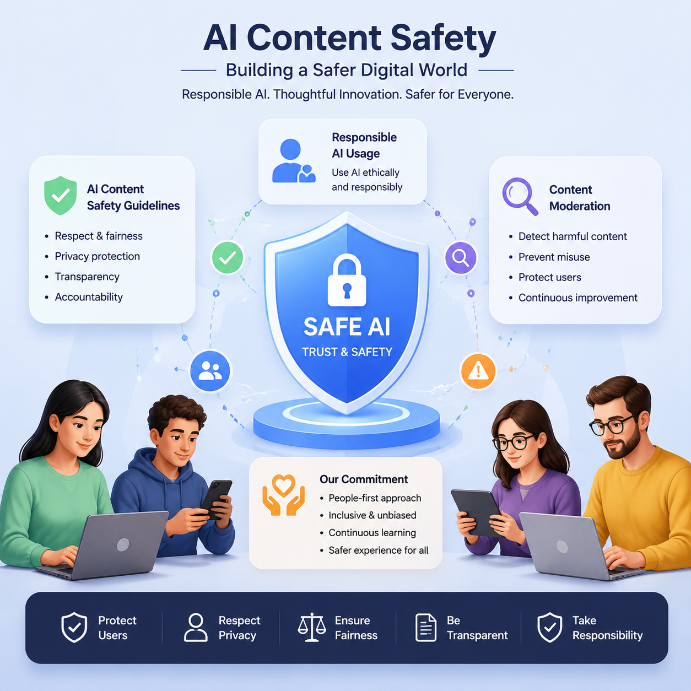

# AI内容安全使用指南，2026年AI生图规范与合规使用

AI生图工具为创作者提供了强大的能力，但同时也需要遵守使用规范。本文介绍AI生图工具的内容安全政策和合规使用指南。

📌 推荐 [aishop.anyachina.cn](https://aishop.anyachina.cn) 和 [poster.anyachina.cn](https://poster.anyachina.cn) 遵守内容安全规范，为用户提供合规的AI生图服务。

## AI生图的内容安全规范

正规的AI生图工具都有严格的内容安全政策，禁止生成以下类型的内容：

- 违法违规内容
- 侵犯他人权益的内容
- 色情低俗内容
- 暴力血腥内容
- 虚假信息内容

## 为什么AI工具有内容限制？

**法律法规要求**：AI生成内容需要遵守国家法律法规
**社会责任**：防止AI技术被滥用于制作不良内容
**平台规范**：各平台对内容有明确的审核标准

## AI生图的合规使用方法

### 创作合法内容

- 使用AI生成商品图、海报、设计素材等合法内容
- 遵守各平台的发布规范
- 尊重他人知识产权和肖像权

### 保护个人隐私

- 不上传包含他人隐私信息的图片
- 不生成涉及个人敏感信息的图片
- 遵守数据保护相关法规

## AI生图的版权说明

正规AI工具生成的图片版权归用户所有，但用户需要对自己生成的内容负责。使用AI工具时应遵守服务条款和适用法律法规。

---

*在线工具：[未来图AI](https://www.weilaituai.cn/)*
