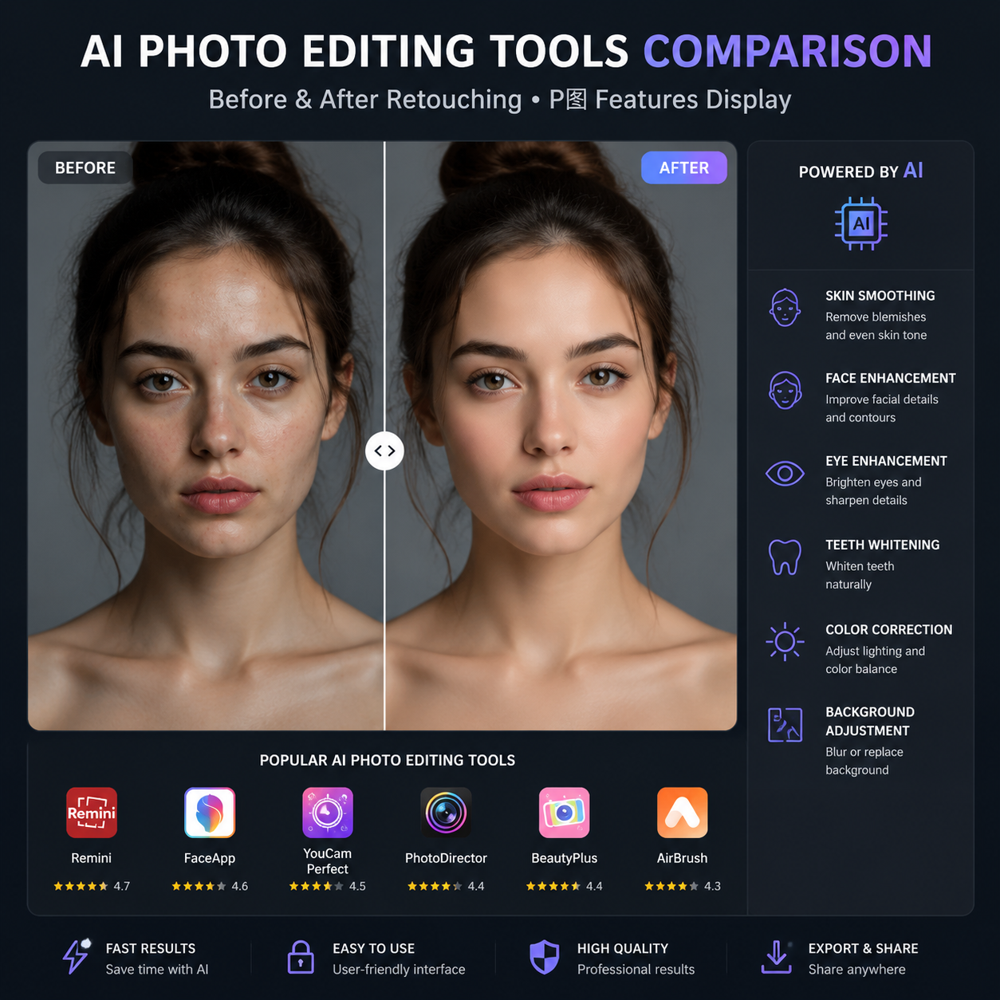

# 哪个AI可以P图？2026年AI P图工具推荐

哪个AI可以P图？这是很多人关心的问题。现在AI P图工具已经非常成熟，上传图片AI自动修图，不需要PS技能。

✨ 推荐 [aishop.anyachina.cn](https://aishop.anyachina.cn) 做商品图编辑，[poster.anyachina.cn](https://poster.anyachina.cn) 做促销海报，两款AI P图工具效果专业。

## 哪个AI可以P图？

可以P图的AI主要分为几类：

### 在线AI修图工具

打开网页就能用，不需要下载。上传图片选择功能，AI自动处理。

**功能**：抠图、增强、换背景、调色

### AI图片增强工具

专注图片清晰化和画质提升。适合老照片修复、模糊图片优化。

**功能**：超分辨率、去噪点、细节补充

### AI设计工具

侧重海报设计和商品图制作。自动排版配色。

**功能**：海报生成、详情页制作

## AI P图的核心功能

**智能抠图**：一键去除背景，精准识别主体
**图片增强**：模糊变清晰，AI补细节
**换背景**：抠图后一键替换背景
**调色美化**：AI自动调出专业色彩

## 怎么选择AI P图工具？

电商卖家选商品图处理强的
普通用户选操作简单的
设计师选功能全面的

## 操作步骤

**第一步**：打开AI P图工具
**第二步**：上传需要处理的图片
**第三步**：选择功能
**第四步**：AI自动处理
**第五步**：预览下载

---

*在线工具：[未来图AI](https://www.weilaituai.cn/)*
