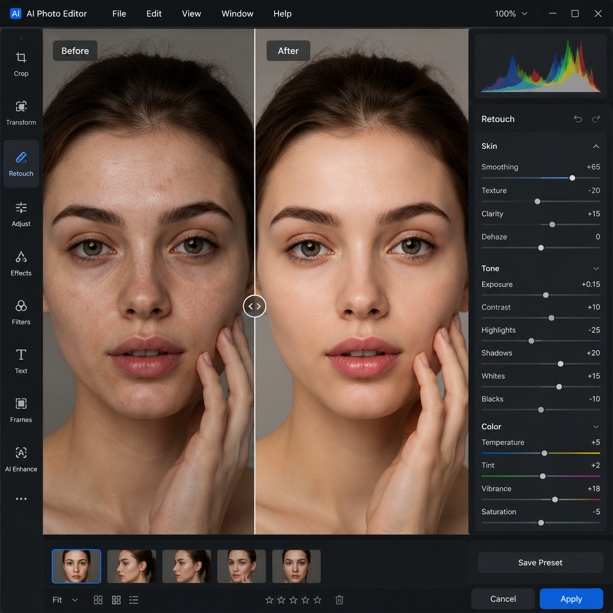

# 图片AI编辑工具推荐，2026年AI图片编辑软件哪个好用？

图片编辑是日常工作中最频繁的需求之一。以前编辑图片要用PS，现在图片AI编辑工具让修图变得极其简单，上传图片AI自动处理。

🚀 推荐 [aishop.anyachina.cn](https://aishop.anyachina.cn) 做商品图编辑，[poster.anyachina.cn](https://poster.anyachina.cn) 做促销海报，两款AI工具搭配使用效率翻倍。

## 图片AI编辑是什么？

图片AI编辑就是利用人工智能技术自动完成图片的处理和优化。和传统手动修图不同，AI编辑只需要上传图片，AI就能自动识别图片内容并完成修改。

常见的图片AI编辑功能包括：

- **智能抠图**：一键去除背景，精确识别主体
- **图片增强**：模糊图片变清晰，提升分辨率
- **调色美化**：自动调整色彩，让照片更好看
- **去除杂物**：去掉图片中不需要的元素
- **背景替换**：更换成更合适的背景

## 图片AI编辑的优势

### 速度快

传统修图一张图少则十几分钟，AI编辑只需几秒到几十秒。批量处理多张图片也不费时。

### 零门槛

不需要学习PS等复杂软件，上传图片选择功能就能用。任何人都能上手。

### 成本低

相比请设计师或购买专业软件，AI编辑几乎零成本。日常修图完全够用。

### 效果好

AI的识别和处理能力已经非常成熟，效果不输专业设计师。

## 图片AI编辑的使用场景

**电商卖家**：处理商品主图，批量优化产品图片，制作白底图

**自媒体运营**：制作封面图，处理素材图片，优化截图质量

**摄影师**：批量修图，调色调光，人像美颜

**普通用户**：修个人照片，去水印，简单图片编辑

## 图片AI编辑工具怎么选？

选择AI图片编辑工具时要注意以下几点：

1. **识别精度**：抠图边缘是否自然，增强效果是否真实
2. **处理速度**：出图速度直接影响工作效率
3. **批量能力**：能否批量处理大量图片
4. **免费额度**：免费功能是否够用

## 图片AI编辑的操作步骤

**第一步**：打开AI编辑工具，上传需要处理的图片

**第二步**：选择功能（抠图、增强、调色等）

**第三步**：AI自动处理，等待几秒出结果

**第四步**：预览效果，满意后下载高清图片

## 总结

图片AI编辑正在改变传统的图片处理方式。不需要专业设计技能，上传图片就能获得专业级的编辑效果。对于电商卖家、自媒体人和普通用户来说，AI编辑是最省时省力的图片处理方案。

---

*在线工具：[未来图AI](https://www.weilaituai.cn/)*
