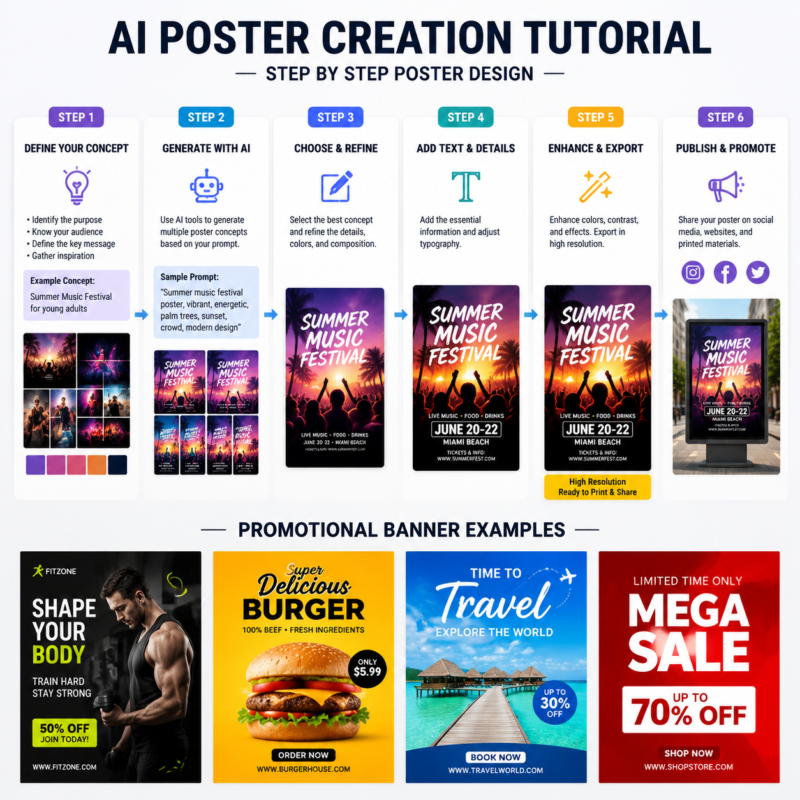

# 怎么用AI生成海报？2026年AI海报生成完整教程

想做个海报还要学设计？其实不用。怎么用AI生成海报？上传产品图、输入文案，AI自动排版设计，几十秒出一张专业海报。

⭐ 试试 [aishop.anyachina.cn](https://aishop.anyachina.cn) 做商品图和详情页，AI海报生成功能一键出图。

## 怎么用AI生成海报？

用AI生成海报很简单，不需要任何设计基础：

**第一步**：打开AI海报生成工具

**第二步**：选择使用场景（促销、新品、品牌、节日等）

**第三步**：上传产品图或品牌素材

**第四步**：输入海报文案（标题、卖点、活动信息）

**第五步**：选择风格偏好，点击生成

**第六步**：AI自动输出海报预览。不满意可重新生成或微调

**第七步**：确认效果后下载高清海报

## AI生成海报的三种方式

### 方式一：模板生成

从模板库选择喜欢的模板，替换产品和文案。操作最简单，适合完全零基础的用户。

### 方式二：AI智能生成

输入产品和文案，AI自动完成设计。不需要选模板，AI自动匹配最好的版式。

### 方式三：文生图

输入一段描述文字，AI直接生成海报。适合没有产品图的场景，比如活动预告、品牌宣传。

## AI海报生成的核心功能

**智能排版**：AI根据内容自动规划布局，标题、图片、文案位置合理

**自动配色**：根据行业和活动类型推荐配色方案

**字体搭配**：AI自动匹配标题和正文字体

**多版本**：一键生成多个风格版本供选择

## AI生成海报的适用场景

- 电商大促海报
- 新品上市宣传
- 节日营销海报
- 社交媒体配图
- 门店促销物料

## 实用技巧

1. **文案精简**：海报文字越精炼越好，核心卖点突出即可
2. **图片清晰**：上传高质量产品图，生成效果更好
3. **风格统一**：同系列海报保持相同风格，强化品牌识别
4. **多版测试**：生成多个版本比较，选转化率最高的

## 常见问题

**问：AI生成的海报能商用吗？**
答：生成图片版权归用户所有，可以商用。

**问：AI海报分辨率够打印吗？**
答：AI生成的海报为高清图片，适合线上使用和打印。

---

*在线工具：[未来图AI](https://www.weilaituai.cn/)*
