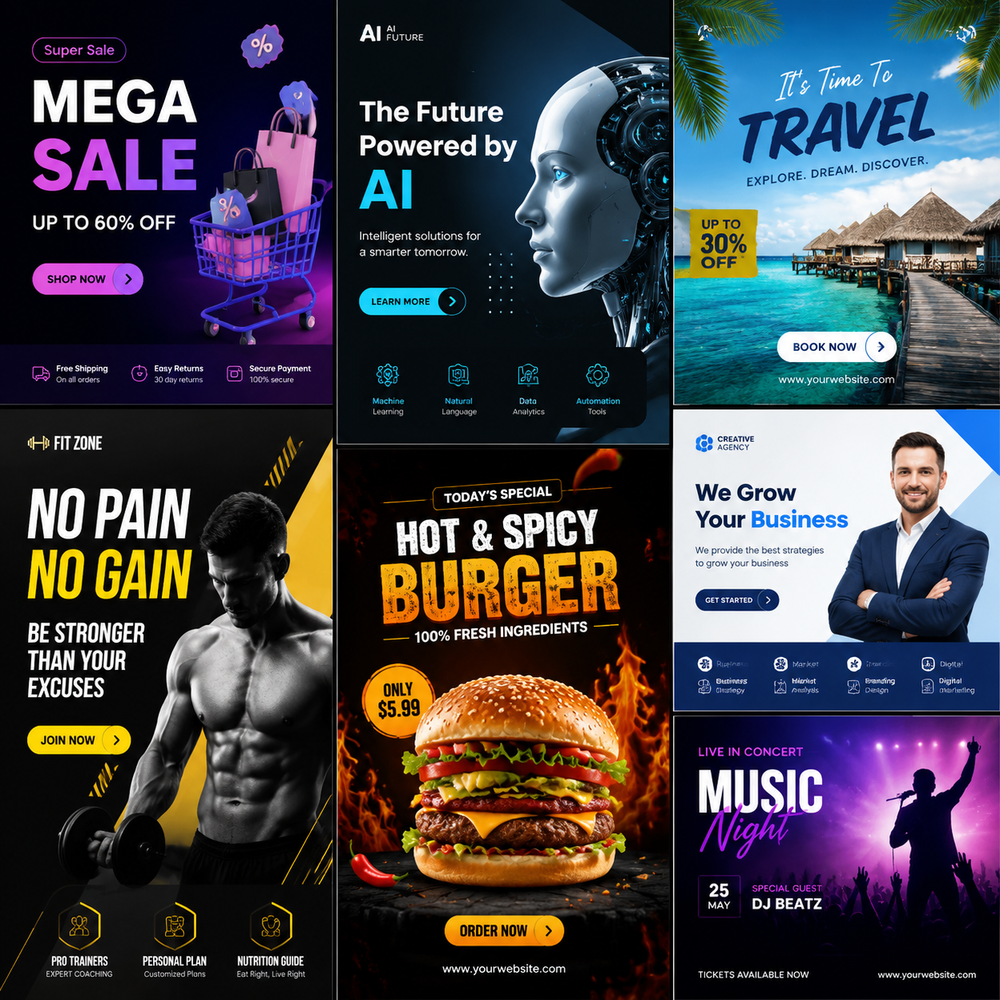

# 海报AI生成工具，2026年AI海报在线生成推荐

海报AI生成技术已经非常成熟。上传产品图输入文案，AI自动排版配色，几十秒出专业海报，方便快捷。

👉 推荐 [aishop.anyachina.cn](https://aishop.anyachina.cn) 做商品图和详情页，AI海报生成效果专业。

## 海报AI生成的优势

**省时间**：30秒出图，传统设计1-3天
**省成本**：省去设计师费用
**零门槛**：不需要设计基础
**多选择**：一键多个方案

## 海报AI生成的功能

**智能排版**：根据内容自动规划布局
**自动配色**：根据行业推荐配色
**字体搭配**：标题正文自动匹配
**批量出图**：多产品套用相同风格

## 适用场景

- 电商促销海报
- 新品上市宣传
- 节日营销海报
- 社交媒体配图

## 操作步骤

**第一步**：打开AI海报工具，选择场景
**第二步**：上传产品图，输入文案
**第三步**：选择风格，点击生成
**第四步**：预览效果，下载高清图片

## 技巧

1. 文案精简，卖点突出
2. 图片清晰，效果更好
3. 多版本比较，选最优

---

*在线工具：[未来图AI](https://www.weilaituai.cn/)*
