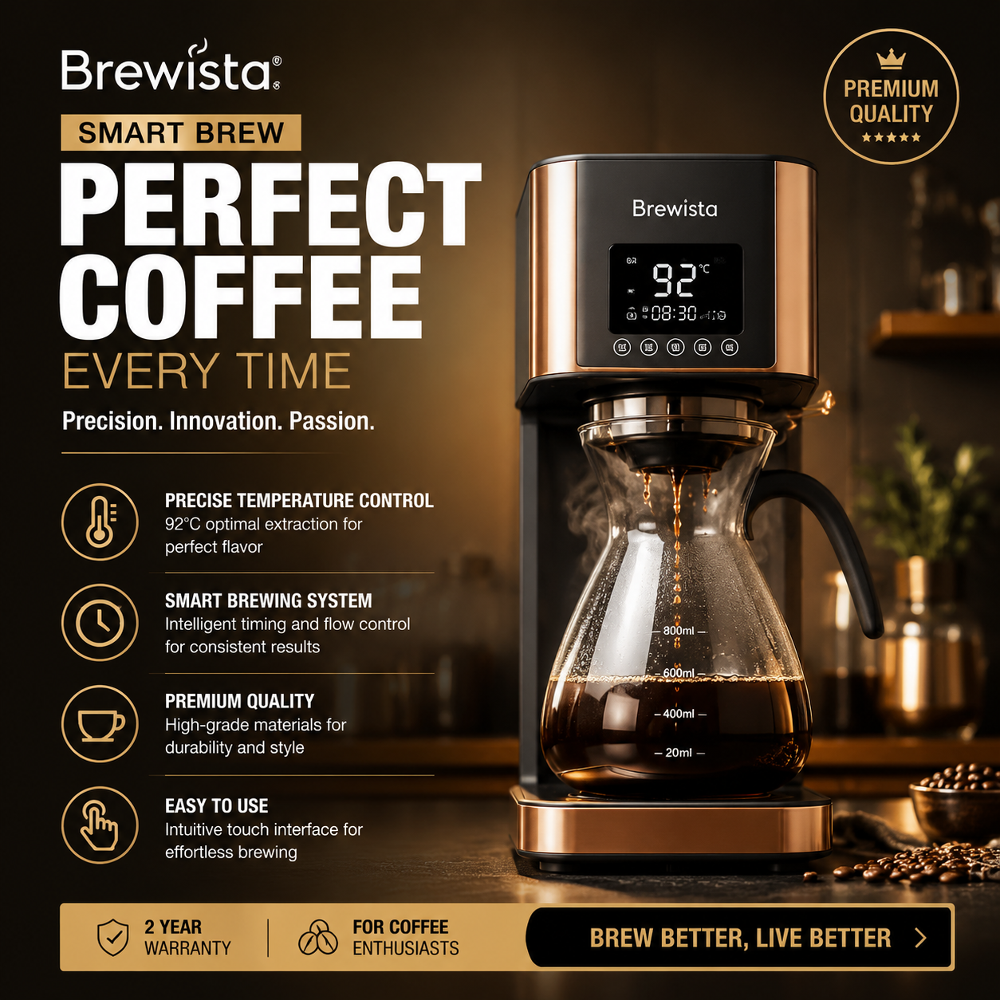

# 海报AI生成工具推荐，2026年AI海报生成器实测

做海报还要请设计师？2026年海报AI生成工具已经非常成熟了。上传产品图、输入文案，AI自动排版设计，30秒生成一张专业海报。

👉 推荐工具：[aishop.anyachina.cn](https://aishop.anyachina.cn) 电商商品图生成效果好，搭配做海报效率更高。

## 海报AI生成是什么？

海报AI生成就是利用人工智能技术，自动完成海报的排版、配色、字体搭配等设计工作。你只需要提供产品和文案，AI就帮你搞定设计。

和传统海报设计相比，AI生成海报有几个明显优势：

- **速度快**：传统设计1-3天，AI生成30秒
- **成本低**：不必付费设计师，几乎零成本
- **多版本**：一键生成多个设计方案供选择
- **零门槛**：不需要设计技能，人人可用

## 海报AI生成工具的常见功能

### 1. 智能排版

AI根据你的产品和文案内容，自动选择最优的排版方式。标题放哪里、产品放哪里、背景用什么，AI都自动搭配好。

### 2. 配色方案

AI会根据产品类型和行业特性，推荐合适的配色方案。食品类用暖色、科技类用冷色、美妆类用柔和色，AI都懂。

### 3. 模板匹配

根据使用场景（促销、新品上市、节日活动），AI自动匹配最适合的模板风格。

### 4. 文字自动适配

AI会根据文案长度自动调整字体大小和位置，不会出现文字溢出或太空的问题。

## 海报AI生成的使用步骤

**第一步**：打开海报AI生成工具，选择"新建海报"

**第二步**：选择使用场景（促销、品牌、活动等）

**第三步**：上传产品图，输入海报文案和卖点

**第四步**：选择风格偏好（简约、高端、活泼等）

**第五步**：点击生成，AI自动输出海报预览。不满意可以重新生成或微调

## 海报AI生成的适用场景

**电商促销**：双11、618等大促海报，AI批量生成不同商品的海报

**新品发布**：新产品的宣传海报，快速出图抢占市场

**社交营销**：朋友圈、小红书、Instagram等平台的宣传图

**线下物料**：门店海报、易拉宝、宣传单等线下物料

## 如何选择海报AI生成工具？

1. **模板丰富度**：模板越多，选择空间越大
2. **自定义能力**：是否支持修改颜色、字体、布局
3. **出图速度**：是否能在几秒内生成
4. **导出格式**：是否支持高清PNG、印刷级PDF等

## 海报AI生成 vs 传统设计

| 维度 | AI生图 | 传统设计 |
|------|--------|---------|
| 用时 | 30秒 | 1-3天 |
| 成本 | 几毛钱 | 几百上千 |
| 技能要求 | 零基础 | 需设计经验 |
| 修改 | 随时重新生成 | 反复沟通修改 |
| 多版本 | 一键多版 | 需要额外付费 |

---

*在线工具：[未来图AI](https://www.weilaituai.cn/)*
