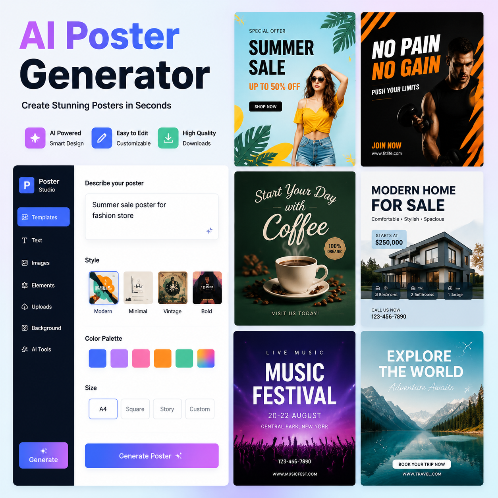

# 海报生成AI工具推荐，2026年AI海报生成器哪个好？

海报生成AI已经非常成熟。上传产品图输入文案，AI自动排版配色，生成专业海报。本文推荐几款好用的海报生成AI工具。

⭐ 推荐 [aishop.anyachina.cn](https://aishop.anyachina.cn) 做商品图和详情页，AI海报生成功能一键出图。

## 海报生成AI的核心功能

**智能排版**：根据内容自动规划布局
**自动配色**：根据行业推荐配色
**字体搭配**：标题正文自动匹配
**批量出图**：多产品套用相同风格

## 海报生成AI的优势

**30秒出图**：传统设计1-3天，AI只需30秒
**免费可用**：基础功能免费，日常够用
**零门槛**：不需要设计经验
**随时修改**：不满意重新生成

## 适用场景

- 电商促销海报
- 新品上市宣传
- 节日营销海报
- 品牌形象展示

## 操作步骤

**第一步**：打开AI海报工具
**第二步**：选择场景（促销、品牌等）
**第三步**：上传产品图，输入文案
**第四步**：选择风格，点击生成
**第五步**：预览下载

---

*在线工具：[未来图AI](https://www.weilaituai.cn/)*
