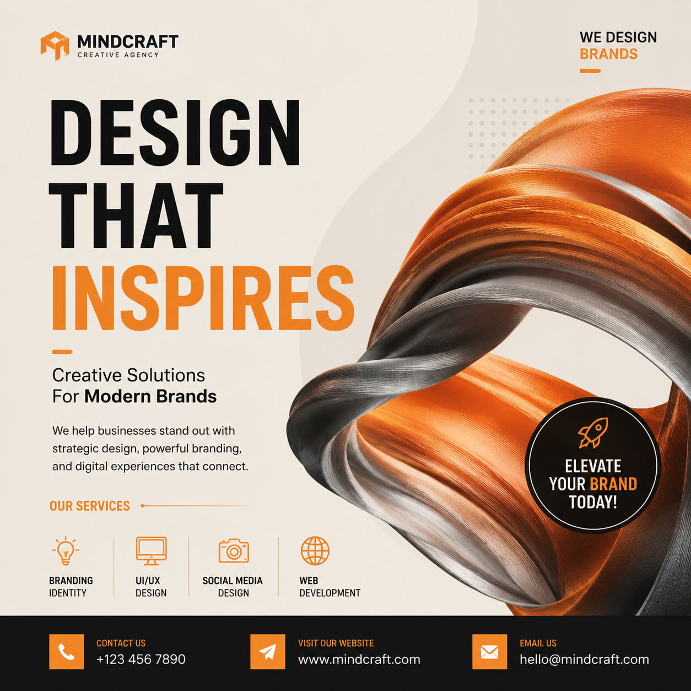

# 海报设计AI工具推荐，2026年海报设计AI哪个好？

海报设计是最常见的设计需求之一。以前做海报要么花钱请设计师，要么自己学PS。现在海报设计AI工具让零基础的人也能做出专业级海报。

👉 试试 [aishop.anyachina.cn](https://aishop.anyachina.cn) 做电商商品图，搭配海报设计效率翻倍。

## 海报设计AI是什么？

海报设计AI是利用人工智能技术自动完成海报版式设计、配色、字体搭配的工具。用户只需要提供产品和文案信息，AI就能在几十秒内生成多张海报设计方案。

相比传统设计方式，AI海报设计有几个显著优势：

- **极速出图**：传统设计1-3天，AI只需几十秒
- **零门槛**：不需要任何设计经验
- **多版本**：一键生成多个风格供选择
- **低成本**：省去设计师费用

## 海报设计AI的核心功能

### 1. 智能版式

AI根据海报用途（促销、品牌、活动）自动选择最佳版式。产品图放哪里、标题放哪里、留白多少，AI都自动规划好。

### 2. 自动配色

AI根据行业和活动类型推荐配色方案。食品用暖色调、科技用冷色调、美妆用柔和色系，不需要专业的色彩知识。

### 3. 字体搭配

AI自动匹配字体风格，标题字体和正文字体协调搭配。不需要自己纠结用什么字体。

### 4. 模板智能匹配

根据使用场景自动推荐最合适的模板。大促海报、新品上市、节日营销，不同场景不同模板。

## 海报设计AI怎么用？

**第一步**：打开海报设计AI工具，创建新设计

**第二步**：选择海报场景（促销、品牌、活动等）

**第三步**：上传产品图片，输入文案内容

**第四步**：选择风格偏好，点击生成

**第五步**：浏览AI生成的多个方案，选择满意的一个下载

## 适用场景

- 电商大促海报（双11、618、年终大促）
- 新品上市宣传海报
- 社交媒体营销图（朋友圈、小红书）
- 门店促销物料
- 品牌形象海报

## 选择海报设计AI的要点

1. **模板数量**：模板越多，出图质量越高
2. **自定义程度**：能否调整颜色、字体、元素
3. **出图速度**：是否秒级出图
4. **导出格式**：是否支持高清和印刷级

## AI设计vs人工设计

| 维度 | AI设计 | 人工设计 |
|------|--------|---------|
| 出图速度 | 30秒 | 1-3天 |
| 设计成本 | 几乎免费 | 几百上千 |
| 技能要求 | 无 | 需要经验 |
| 修改 | 一键重来 | 反复沟通 |
| 创意 | 模板化 | 个性化 |

---

*在线工具：[未来图AI](https://www.weilaituai.cn/)*
