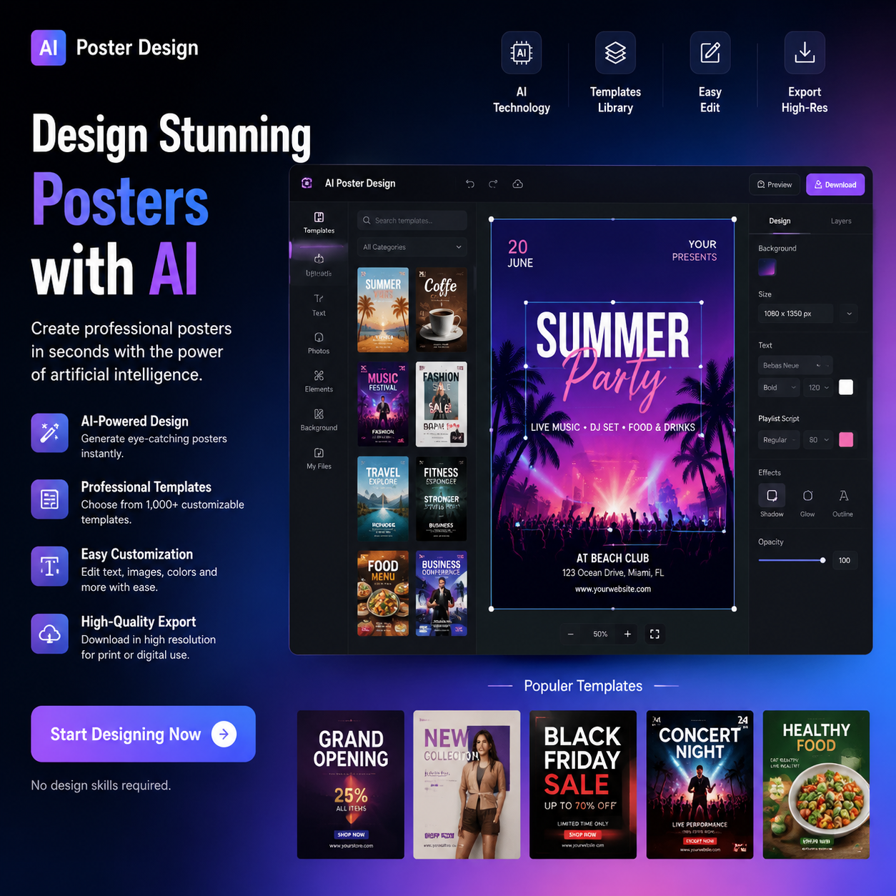

# 海报设计AI工具推荐，2026年海报设计AI工具哪个好？

做海报还用请设计师？海报设计AI工具已经完全可以满足日常需求。上传产品图、输入文案，AI自动生成专业海报。

👉 试试 [aishop.anyachina.cn](https://aishop.anyachina.cn) 做商品图和详情页，AI海报设计功能一键出图。

## 海报设计AI工具的核心功能

### 智能排版

AI根据海报用途自动选择最优版式。产品图位置、标题大小、文案布局都由AI智能安排。

### 自动配色

根据产品和行业特性，AI推荐最适合的配色。食品用暖色、科技用冷色、美妆用柔和色。

### 字体搭配

标题字体和正文字体自动匹配。不用纠结用什么字体，AI帮你搞定。

### 批量生成

多款产品套用相同风格，一次性生成多张海报。适合电商大促前集中出图。

## 海报设计AI工具的适用场景

**电商促销**：大促海报、限时折扣、满减活动
**新品上市**：新产品宣传海报
**品牌推广**：品牌形象海报
**社交媒体**：小红书、朋友圈配图

## AI设计vs人工设计

| 对比 | AI设计 | 人工设计 |
|------|--------|---------|
| 速度 | 30秒 | 1-3天 |
| 成本 | 免费 | 几百元 |
| 技能 | 零基础 | 需经验 |
| 修改 | 一键重来 | 反复沟通 |

## 操作步骤

**第一步**：打开AI海报设计工具
**第二步**：选择场景（促销、品牌、活动等）
**第三步**：上传产品图，输入文案
**第四步**：选择风格，点击生成
**第五步**：预览效果，下载高清图片

## 选择要点

1. 模板丰富度
2. 出图速度和质量
3. 自定义灵活度
4. 免费额度

---

*在线工具：[未来图AI](https://www.weilaituai.cn/)*
