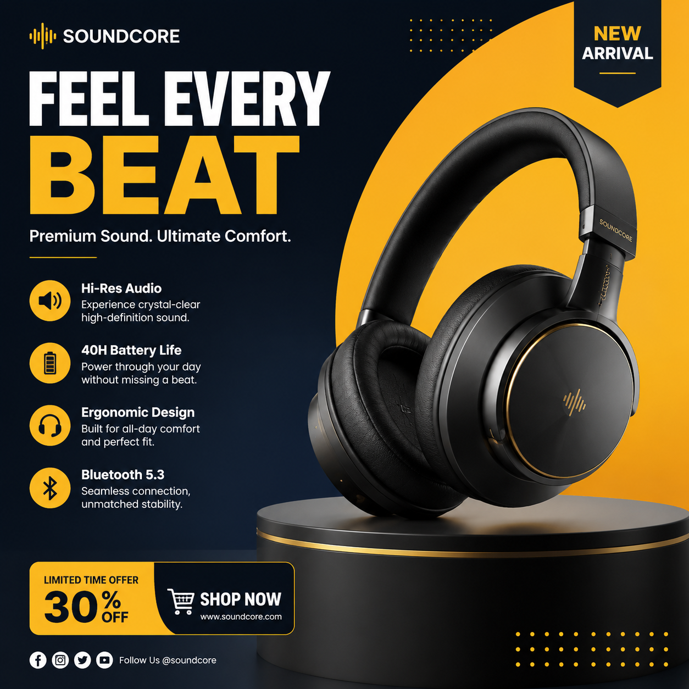

# 生成海报用哪个AI？2026年AI生成海报工具推荐

海报是营销推广的必备素材，但很多人不知道生成海报用哪个AI最好。本文实测对比几款主流AI海报生成工具，帮你找到最适合的。

👉 推荐 [aishop.anyachina.cn](https://aishop.anyachina.cn) 做电商商品图和详情页，搭配AI海报生成工具效果更佳。

## 生成海报用哪个AI最靠谱？

选择AI海报生成工具主要看这几个维度：

**出图质量**：海报的视觉效果是否专业，排版是否合理
**操作难度**：是否需要设计基础，提示词好不好写
**生成速度**：出图快不快，等太久影响效率
**模板丰富度**：是否有足够多的模板可选
**价格**：免费够不够用，付费贵不贵

## 热门AI海报工具对比

### 1. AI海报设计工具

这类工具专为海报设计优化，支持中文提示词，上传产品图输入文案就能生成。

**优点**：操作简单，电商模板丰富，出图速度快
**适合**：电商卖家、运营人员

### 2. 通用AI生图工具

功能全面，支持各种风格，从写实到插画都能生成。但需要写好提示词才能出好图。

**优点**：创意空间大，风格多样
**适合**：有设计基础的用户

### 3. 在线海报模板工具

提供大量模板，用户替换内容即可。操作最简单但创意受限。

**优点**：上手最快，零学习成本
**适合**：完全不懂设计的用户

## AI生成海报的实用技巧

### 文案要精简

海报空间有限，文字越多排版越难。把核心卖点提炼成短句，AI排版效果更好。

### 图片要高清

AI是在原图基础上创作，上传高清产品图，生成的海报效果更专业。

### 多版本选择

同一个需求让AI生成多个版本，不同配色和布局，选最满意的一个。

### 风格统一

同一系列海报用相同的风格模板，品牌视觉更统一。

## AI海报生成的操作步骤

**第一步**：打开AI海报工具，选择"新建海报"

**第二步**：选择使用场景（促销、新品、品牌等）

**第三步**：上传产品图，输入海报文案

**第四步**：选择风格偏好，点击生成

**第五步**：预览效果，满意后下载高清图片

## 常见问题

**问：AI生成的海报能商用吗？**
答：大部分AI工具生成的图片版权归用户所有，可以商用。

**问：AI海报的分辨率够用吗？**
答：AI生成的海报通常为高清分辨率，适合线上使用和打印。

---

*在线工具：[未来图AI](https://www.weilaituai.cn/)*
