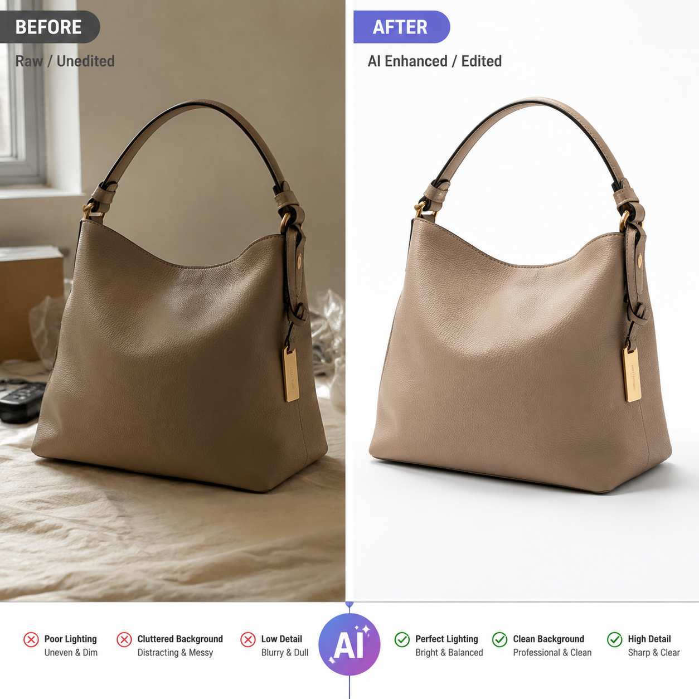

# 电商AI作图怎么做？2026年电商图片AI生成教程

电商作图是每个卖家的刚需，但请设计师太贵，自己P图又不会。现在用AI作图，30秒搞定一张商品图，成本几乎为零。

🚀 试试 [aishop.anyachina.cn](https://aishop.anyachina.cn) 一键生成商品图和详情页，[poster.anyachina.cn](https://poster.anyachina.cn) 一键做促销海报，全套电商视觉都能搞定。

## 电商AI作图是什么？

电商AI作图就是利用AI技术，自动生成商品主图、详情页、白底图等电商图片。你只需要上传一张产品原图，AI就能自动抠图换背景、调光影、优化细节，效果堪比专业摄影。

和传统作图相比，AI作图不需要学PS、不需要搭摄影棚、不需要请模特。上传图片，选好风格，一键生成。

## 电商AI作图怎么做？三步搞定

### 第一步：准备产品原图

用手机拍一张产品照片就好。注意光线均匀、背景不要太杂乱。不需要专业设备，手机拍摄完全够用。

### 第二步：选择想要的风格

想好你要的效果类型：
- 白底图：适合上架主流电商平台，干净规范
- 场景图：把产品放到使用场景中，更有代入感
- 模特展示：服装类可以AI生成模特上身效果

### 第三步：AI一键生成

把原图上传到AI作图工具，选择风格，点击生成。30秒内就能出图。不满意可以重新生成，直到满意为止。

## AI作图的实战技巧

1. **产品图要清晰**：原图越清晰，AI出图效果越好
2. **主体突出**：产品在画面中占比要大，背景简单
3. **多试几种风格**：同一个产品可以生成多种风格，测试哪种转化率高

## 总结

电商AI作图已经不是什么高科技了，现在每个卖家都能用。关键是选对工具，掌握基本技巧，就能省下大笔摄影和设计费用。

---

*在线工具：[未来图AI](https://www.weilaituai.cn/)*
