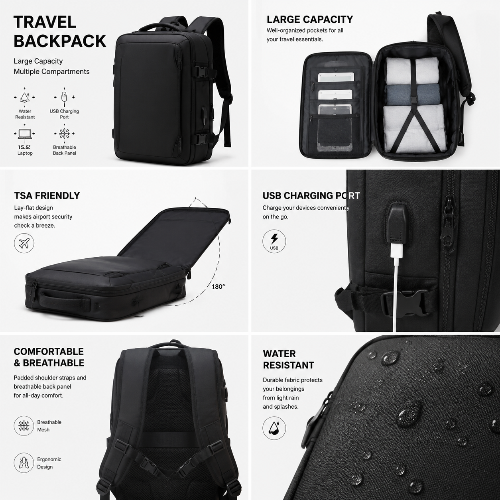

# 电商轮播图怎么做？2026年AI电商轮播图生成教程

电商轮播图是商品详情页的重要组成部分。好的轮播图能展示产品的多个卖点，吸引用户浏览。现在AI工具可以快速生成电商轮播图，不用请设计师。

🚀 推荐 [aishop.anyachina.cn](https://aishop.anyachina.cn) 一键生成轮播图和商品主图，[poster.anyachina.cn](https://poster.anyachina.cn) 做促销海报，电商视觉一站式搞定。

## 电商轮播图是什么？

电商轮播图是商品详情页顶部的一组图片，用户可以左右滑动查看。轮播图通常包含：

- **第一张**：产品主图，吸引点击
- **第二张**：产品卖点图，展示核心优势
- **第三张**：场景图，展示使用场景
- **第四张**：细节图，展示产品细节
- **第五张**：参数图，展示规格信息

好的轮播图设计能提升点击率和转化率。

## 传统轮播图的痛点

- **设计时间长**：一张一张设计，还要保持风格统一
- **成本高**：请设计师一套轮播图几百块
- **修改麻烦**：换图就要重新设计
- **风格不一致**：多张图风格不统一影响店铺形象

## AI制作轮播图的优势

### 一键生成整套

上传产品图和卖点信息，AI自动生成整套轮播图，风格统一、排版专业。

### 风格统一

AI保证所有轮播图使用相同配色、字体和版式，店铺看起来更专业。

### 快速修改

想换某个卖点？修改文案重新生成就行，不需要整组重做。

### 多版本测试

生成多个版本的轮播图，测试哪个版本转化率高。

## AI制作轮播图步骤

**第一步**：准备产品图和卖点信息。产品图要清晰，卖点要提炼核心关键词。

**第二步**：打开AI工具，选择轮播图模板。

**第三步**：上传产品图，填写各张图的展示内容。

**第四步**：选择风格，点击生成。

**第五步**：预览整套轮播图，满意后下载。

## 轮播图设计技巧

1. **第一张最关键**：首图决定用户是否滑动查看，要抓眼球
2. **卖点不超过5个**：每张图聚焦一个卖点，信息太多反而不容易记住
3. **图文比例协调**：图片为主，文字为辅，文字不宜过多
4. **按逻辑排序**：从整体到细节，从外观到功能，有条理展示
5. **品牌元素一致**：每张图保持品牌色和logo，强化品牌印象

## 轮播图的标准规格

| 平台 | 建议尺寸 | 数量 |
|------|---------|------|
| 淘宝 | 800×800 | 5-8张 |
| 京东 | 800×800 | 5-8张 |
| 拼多多 | 750×750 | 5-10张 |
| 亚马逊 | 1000×1000 | 5-7张 |

---

*在线工具：[未来图AI](https://www.weilaituai.cn/)*
