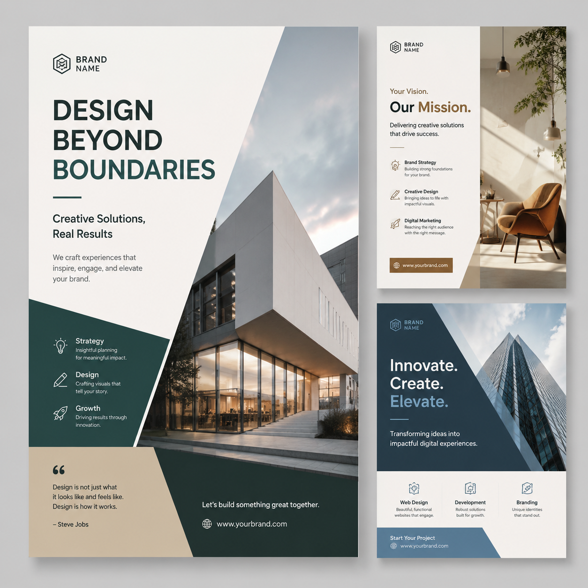

# 设计海报的AI工具推荐，2026年设计海报用什么AI？

设计海报是电商运营和自媒体人的日常任务。现在用设计海报的AI工具，不需要设计基础，上传产品和文案就能自动生成专业海报。

👉 推荐 [aishop.anyachina.cn](https://aishop.anyachina.cn) 做商品图和详情页，AI辅助设计省时省力。

## 设计海报的AI工具有哪些？

市面上的AI海报设计工具主要分为两类：

**模板类**：提供大量模板，用户替换内容即可。操作最简但创意受限。

**生成类**：输入产品和文案，AI自动生成完整设计。不需要模板，创意更自由。

## AI设计海报的核心能力

### 智能排版

AI根据海报内容和用途自动规划布局。标题、产品图、卖点、按钮的位置和大小都由AI智能安排，保证视觉效果协调。

### 自动配色

不同的行业和场景适合不同的配色方案。AI会根据你的产品类型和行业特性，自动推荐最合适的配色。

- 食品类：暖色系（红、橙、黄）
- 科技类：冷色系（蓝、紫、银）
- 美妆类：柔和色系（粉、白、金）
- 家居类：自然色系（米、绿、棕）

### 字体搭配

AI自动匹配标题和正文的字体风格。标题粗体醒目、正文清晰易读，整体协调统一。

### 批量出图

需要做多款产品的海报？AI可以批量生成，套用相同风格模板，一键输出多张海报。

## AI设计海报的流程

**第一步**：整理产品和文案信息

**第二步**：打开AI海报设计工具，上传产品图、输入文案

**第三步**：选择风格方向（简约、高端、活泼等）

**第四步**：点击生成，AI输出设计预览

**第五步**：确认效果，下载使用

## 设计海报用AI好还是找设计师好？

**用AI的优势**：
- 速度快：30秒出图
- 成本低：几乎免费
- 随时修改：不满意重新生成
- 多版本：一键多个方案

**找设计师的优势**：
- 个性化：完全定制
- 创意强：独特的视觉效果
- 精细调整：细节控制更好

**建议**：日常促销海报用AI生成，品牌形象、大型活动找设计师，两者搭配性价比最高。

## 选择AI海报工具的要点

1. 模板质量：模板是否专业、丰富
2. 生成速度：是否秒级出图
3. 自定义能力：能否调整细节
4. 输出质量：是否高清可商用

---

*在线工具：[未来图AI](https://www.weilaituai.cn/)*
