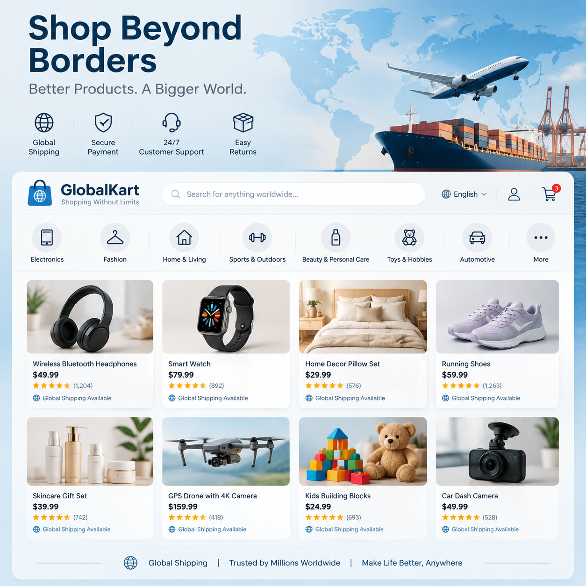

# 跨境电商AI工具推荐，2026年跨境电商必备AI工具

做跨境电商的卖家都懂，商品图、详情页、翻译、文案……每一项都是时间和成本的投入。现在跨境电商AI工具让这些工作自动化，上传产品图就能生成多语种商品页面，效率翻倍。

✨ 用 [aishop.anyachina.cn](https://aishop.anyachina.cn) 生成商品主图和详情页，[poster.anyachina.cn](https://poster.anyachina.cn) 做促销海报，跨境卖家必备组合。

## 跨境电商AI工具能做什么？

### 1. 商品图自动生成

跨境电商对图片要求高，不同平台（亚马逊、Shopee、Lazada）还有不同尺寸要求。AI工具可以：
- 一键生成白底商品图，符合各平台上架标准
- 自动生成场景图，把产品放到使用场景中
- 批量处理，几百张图几分钟搞定
- 适配多平台尺寸

### 2. 多语言详情页

跨境卖家的商品要面对不同国家的买家。AI工具可以自动生成多语言版本的详情页，不用请翻译，省下一大笔费用。

### 3. 智能抠图换背景

跨境商品的拍摄成本高，AI抠图换背景功能让卖家可以在办公室拍产品，AI自动换背景，效果媲美专业摄影棚。

## 跨境电商AI工具怎么用？

使用流程非常简单：

**第一步**：注册登录AI工具，选择电商模板

**第二步**：上传产品照片，填写产品信息和卖点

**第三步**：选择目标市场和语言，AI自动适配

**第四步**：一键生成，预览效果，满意后下载使用

## 跨境电商AI工具的三大优势

**省成本**：省去摄影、设计、翻译的费用，一个人就能运营店铺

**提效率**：原本需要几天的商品图制作，现在几十分钟完成

**标准化**：所有商品图风格统一，店铺看起来更专业

## 选择跨境电商AI工具的要点

1. **多语言支持**：是否支持目标市场的语言
2. **平台适配**：是否支持亚马逊、Shopee等平台规格
3. **图片质量**：生成图片的分辨率和细节是否达标
4. **处理速度**：批量处理效率如何

## 总结

对于跨境电商卖家来说，AI工具已经从"锦上添花"变成了"刚需"。不管是商品图制作、详情页生成还是多语言适配，AI都能大幅提升效率、降低成本。

---

*在线工具：[未来图AI](https://www.weilaituai.cn/)*
